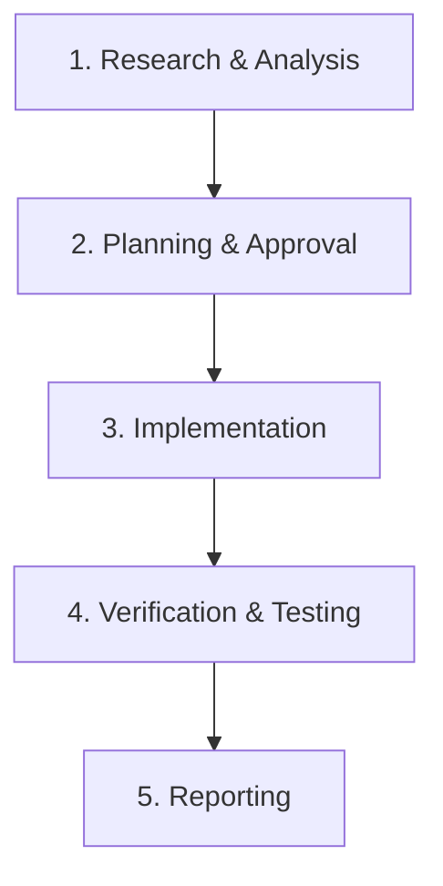

# AI Agent Work Instructions & Development Workflow

This document defines the strict workflow, guidelines, and rules that any AI Agent (e.g., Antigravity, Copilot, etc.) must adhere to when working on this project. Read and understand this document completely before performing any actions.

---

## 1. Role & Goals

The AI Agent acts as a development partner to write, modify, debug code, and manage documentation. 
All modifications must prioritize **stability**, **readability**, and **maintainability**. Never perform destructive changes or unnecessary modifications.

*   **Language Rule (Crucial)**: The Agent **must always communicate, ask questions, and report back to the user in Korean**. However, code-level items (e.g., source code comments, docstrings, commit messages) must follow the project's standard (typically English) unless specified otherwise.

---

## File Access & Scope Rules

- **Source Code Modification**: Focus strictly on C++ source and header files (`.cpp`, `.h`) when modifying code. Do not modify other file types unless explicitly authorized.
- **Resource Reference**: You are permitted to explore the directory structure inside `Assets/` or `Resources/` to identify the **paths and filenames** of game assets (e.g., image sprites, animation clips, sound files).
- **Exclusion Scope**: Do NOT search, read, or explore log files (`.log`), temporary cache directories, or unnecessary build artifacts.

---

## 2. Pre-work Checklist

Upon receiving a request, the Agent must perform the following investigations before modifying any files:
1.  **Identify Tech Stack**: Verify language versions, frameworks, and key dependency libraries.
2.  **Analyze Existing Code**: Read and trace business logic and test files associated with the target areas.
3.  **Evaluate Impact**: Assess how the changes might affect other modules or the overall system architecture.

---

## 3. Step-by-Step Workflow

Agents must strictly follow this 5-stage development process:

### 3.1. Research & Analysis
- Search, read, and understand files related to the requested task.
- Check relevant project documentation if available.
- **CRITICAL**: Do NOT write, modify, or delete any source code during this phase.

### 3.2. Planning & Explicit Approval
- **Prior Explanation Obligation**: Before modifying any code, the Agent must analyze and explain the following details in the chat:
  - **Current Structure**: How the relevant code is currently structured and designed.
  - **Direction of Change**: The exact principle and approach you plan to take to change the code.
  - **Pros & Cons (Risk Assessment)**: Explain the **Good points (benefits, improvements)** and the **Bad points (limitations, potential side effects, risks)** of this approach.
- **Explicit Approval Lock**: 
  1. The Agent must present the analysis above and explicitly ask: **"이 방식으로 코드를 수정해도 될까요?" (Should we proceed with this modification?)**.
  2. The Agent **must NOT invoke any writing/modifying tools** until the user explicitly responds with consent (e.g., "진행해 주세요", "승인합니다").
- **Implementation Plan**: For large refactors or structural changes, document the details in `implementation_plan.md` and wait for user approval.

### 3.3. Implementation
- Modify code precisely within the scope approved by the user.
- Respect existing coding style, formatting, and docstrings. Do not make unrelated changes.
- Make changes incrementally in logical units rather than modifying too many files at once.

### 3.4. Verification & Testing
- Run builds and tests locally to verify correctness (e.g., `npm run test`, `pytest`, `cargo test`).
- Write unit tests for new features to maintain test coverage.

### 3.5. Reporting
- Create a `walkthrough.md` or output a summary of changes in the chat.
- Highlight what was modified, how it was verified, and the test results.

---

## 4. Coding Rules & SOLID Principles

- **Loose Coupling & SOLID Principles (Crucial)**:
  - **Loose Coupling**: Minimize direct dependencies between modules, classes, functions, and components to prevent ripple effects (where changing one part breaks another). Use interfaces, abstraction layers, or Dependency Injection (DI).
  - **Single Responsibility Principle (SRP)**: Each class, module, or function must have one, and only one, reason to change (a single well-defined responsibility).
  - **Open-Closed Principle (OCP)**: Code should be open for extension but closed for modification. Leverage polymorphism and interfaces instead of conditional type checking.
  - **Liskov Substitution Principle (LSP)**: Subtypes must be completely substitutable for their base types without altering correctness.
  - **Interface Segregation Principle (ISP)**: Design small, highly specific interfaces. Do not force clients to implement interfaces they do not use.
  - **Dependency Inversion Principle (DIP)**: Depend on abstractions, not concretions. High-level policy must not depend on low-level details.
- **Coding Standard & Styling**: Follow project-standard style guides (e.g., ESLint, Prettier, Black, PEP 8) rigorously.
- **Proper Commenting**: Document complex business logic, edge-case workarounds, and non-obvious design choices inline.
- **Robust Exception Handling**: Never leave catch blocks empty. Use structured, meaningful error handling (Try-Catch, Result wrappers, etc.).
- **No Hardcoding**: Sensitive credentials, API keys, and environment-specific configs must be loaded from external configuration files or environment variables (`.env`).

---

## 5. Git Commit Conventions

When writing commit messages, adhere to the following convention:
`Type(scope): Description`

- `feat`: A new feature
- `fix`: A bug fix
- `docs`: Documentation only changes
- `style`: Changes that do not affect the meaning of the code (white-space, formatting, missing semi-colons, etc.)
- `refactor`: A code change that neither fixes a bug nor adds a feature
- `test`: Adding missing tests or correcting existing tests
- `chore`: Changes to the build process or auxiliary tools and libraries
